# Integrating ansible with jenkins
----------------------------------
* Create 3 instances one with jenkins and java installed in it, other with ansible installed in it as control node (for ansible we require python also,  as we are taking ubuntu machine python will be pre-installed), other machine as ansible node
* Ansible installation process:
* Create users in 2 machines
* Give all the sudoers permissions and password authentication as yes shown below
    ```
    sudo visudo
    sudo vi /etc/ssh/sshd_config
    ```
* Now login the machinces with the users which were created earlier
* One machine will act as ansible control node and other will be as node
* From ansible control node give the following commands for generating the ssh keys and copying them from ansible control node to slave node
    ```
    ssh-keygen
    ssh-copy-id username@privateip
    ssh username@privateip
    Note: privateip should be node's private ip
    ```
* Install ansible by following steps:
    ```
    sudo apt update
    sudo apt install software-properties-common
    sudo add-apt-repository --yes --update ppa:ansible/ansible
    sudo apt install ansible -y
    ansible --version
    ```  
* Create a hosts file and by giving following details
    ```
    all:
      children:
        webserver:
          hosts:
            172.31.82.74:
    ```      
* Check the connection by giving following command
    ```
    ansible -i hosts ping all
    ```    
* Now install jenkins on another machine 
* Jenkins installation script:
    ```
    curl -fsSL https://pkg.jenkins.io/debian-stable/jenkins.io.key | sudo tee \
    /usr/share/keyrings/jenkins-keyring.asc > /dev/null
    echo deb [signed-by=/usr/share/keyrings/jenkins-keyring.asc] \
    https://pkg.jenkins.io/debian-stable binary/ | sudo tee \
    /etc/apt/sources.list.d/jenkins.list > /dev/null
    sudo apt-get update
    sudo apt-get install jenkins
    ```
* Give the administrator password by looking into the following path 
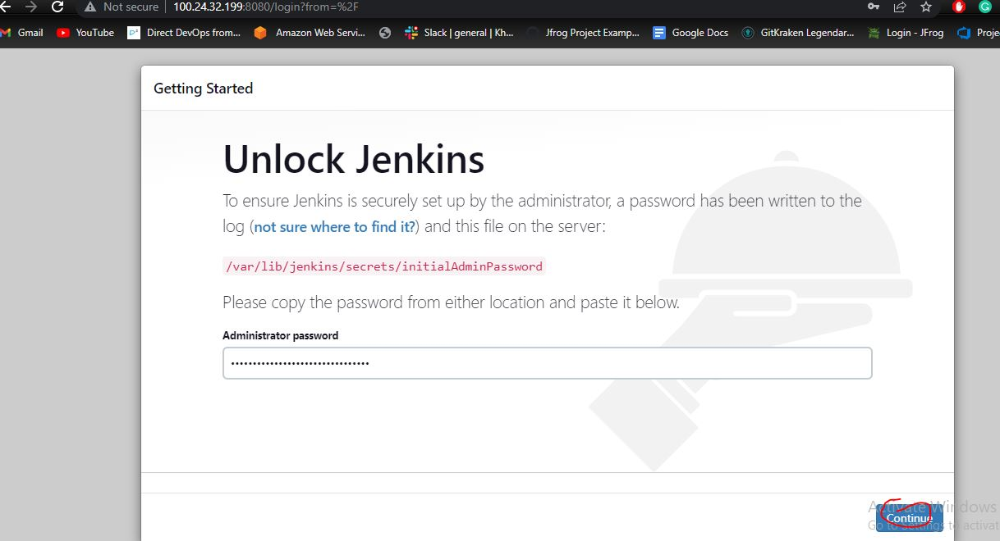
    ```
    sudo cat /var/lib/jenkins/secrets/initialAdminPassword
    ```
* Then go to install suggested plugins
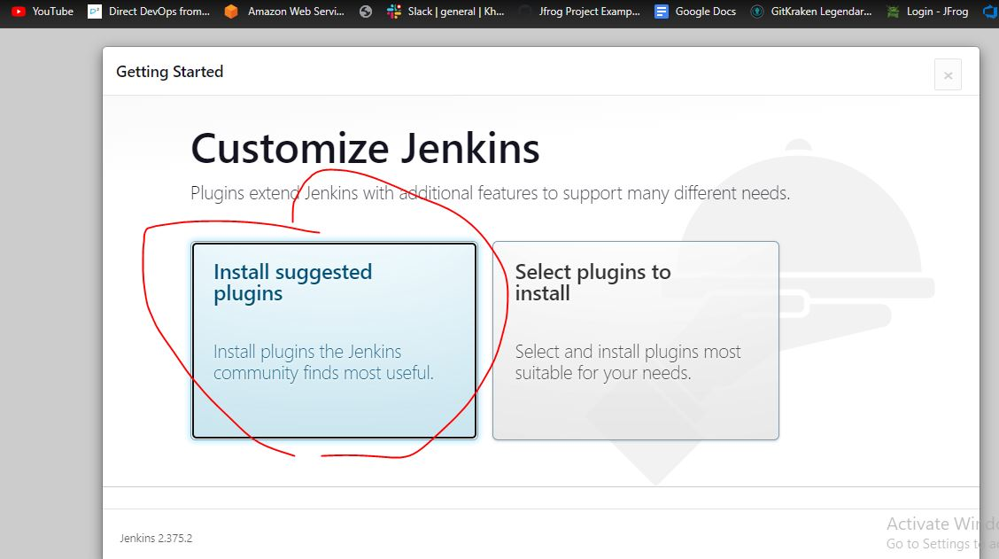
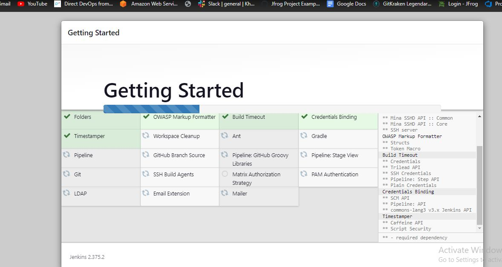
* Give the required username password for jenkins login
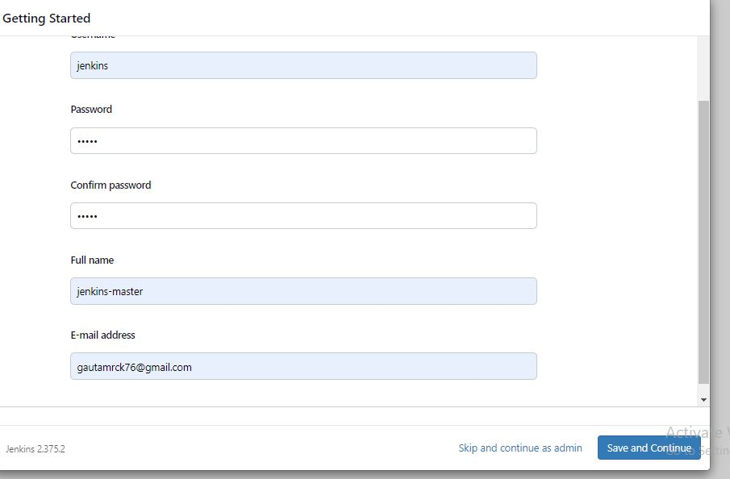
* You will ge the below page as output

* Create a node with ansible and java installed in it.
* Go to manage node give the name of the node and give the required information as shown below
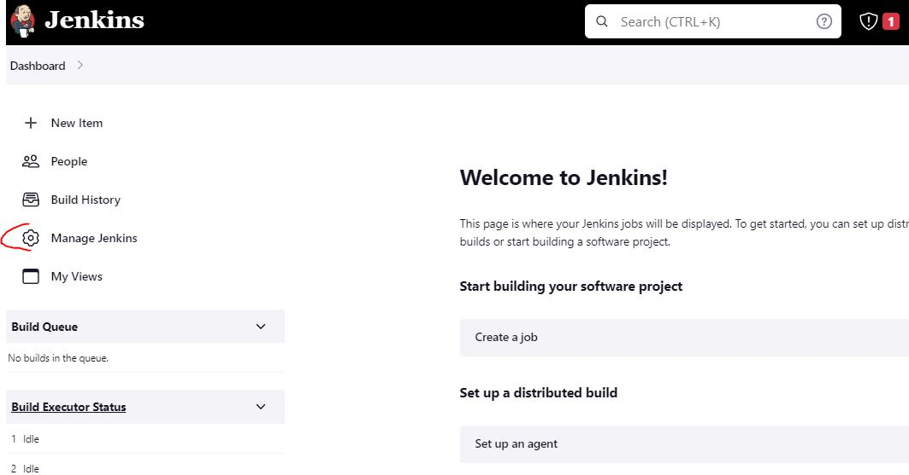
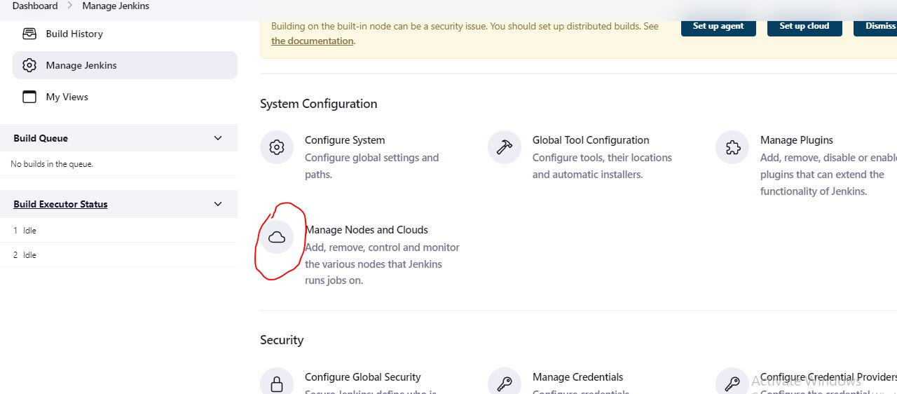
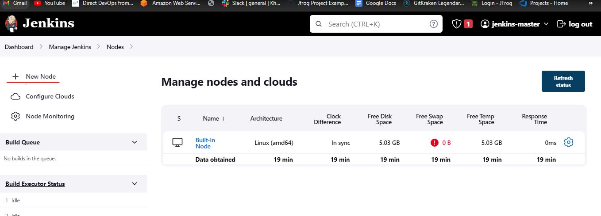
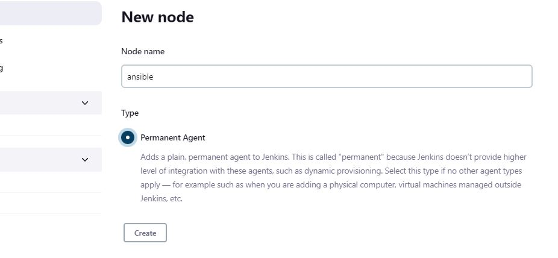
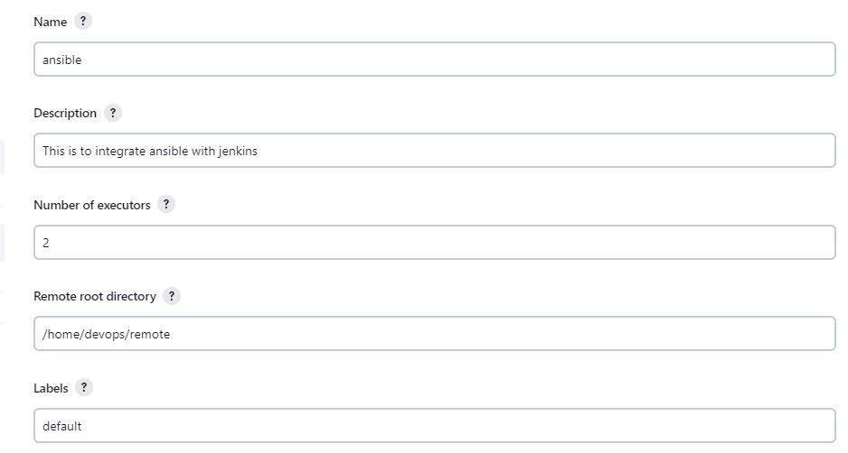
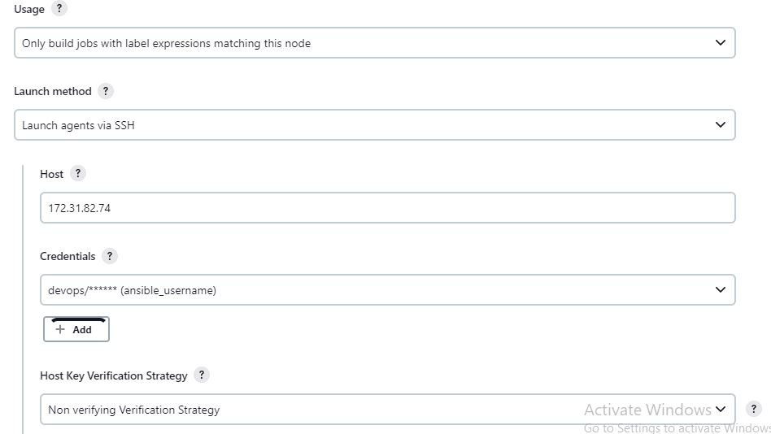
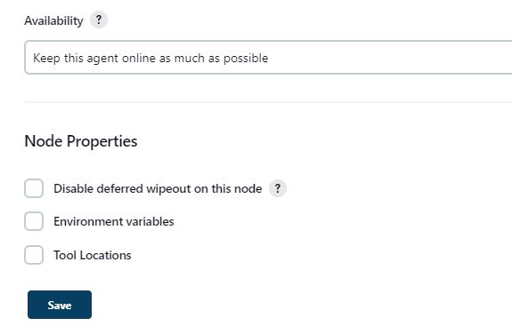
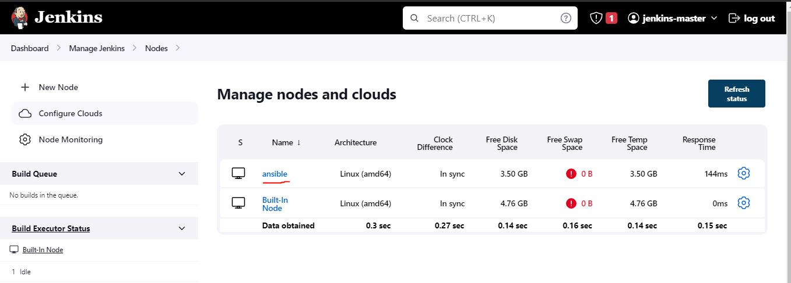
* Connect the node via username and password of the instance which you want to connect via jenkins master
* Create the project 
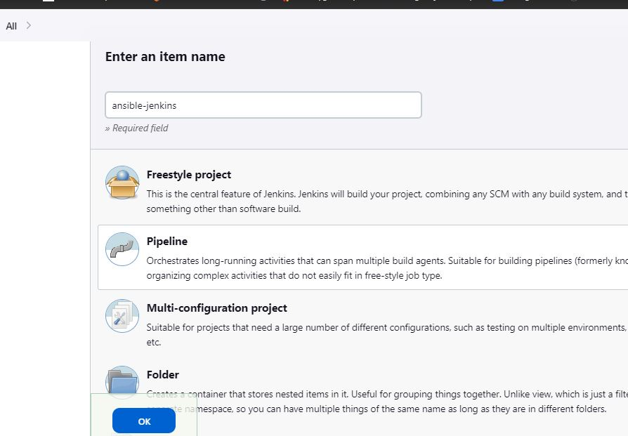
* Write a play book for installing apache2 as show below
```yaml
- name: installing apache and php on ubuntu 22.04
  hosts: all
  become: yes
  vars: 
    apache_package: apache2
  tasks:
    - name: install apache
      ansible.builtin.apt:
        name: "{{ apache_package }}"
        state: present
```
* Write the hosts file as shown below
```yaml
all:
  children:
    webserver:
      hosts:
        172.31.82.74:
          apache_package: apache2
```
* Write the jenkins file as shown below
```yaml
pipeline {
    agent { label 'default'}
    stages {
        stage ('vcs') {
            steps {
                git url: "https://github.com/gautamshrinivas/Ansible.git",
                branch: "main"
            }
        }
        stage ('apply the playbook') {
            steps {
                sh 'ansible-playbook -i joip-jan31/hosts.yaml joip-jan31/apache-php.yaml'
            }
        }
    }
}
```
* Push all the files to your github and go to jenkins 
* Apply the declarative pipleline as shown below
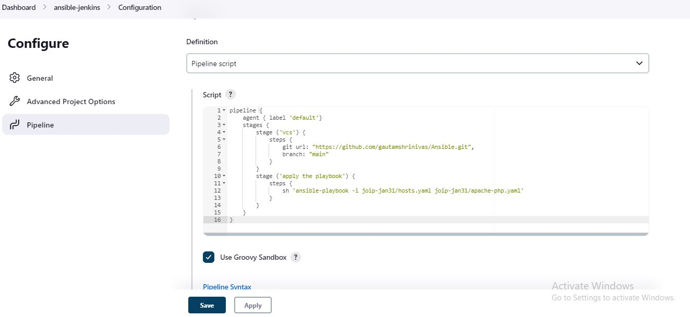
* Apply build
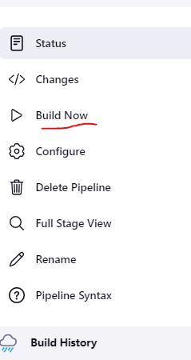
* Build was success as shown below
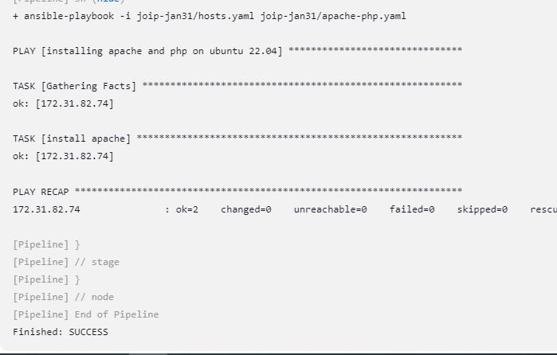
* Check the output page of apache2 by giving publicip:80
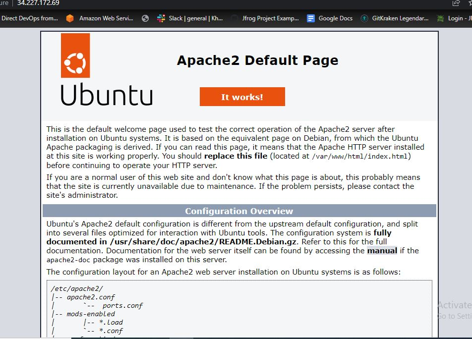
